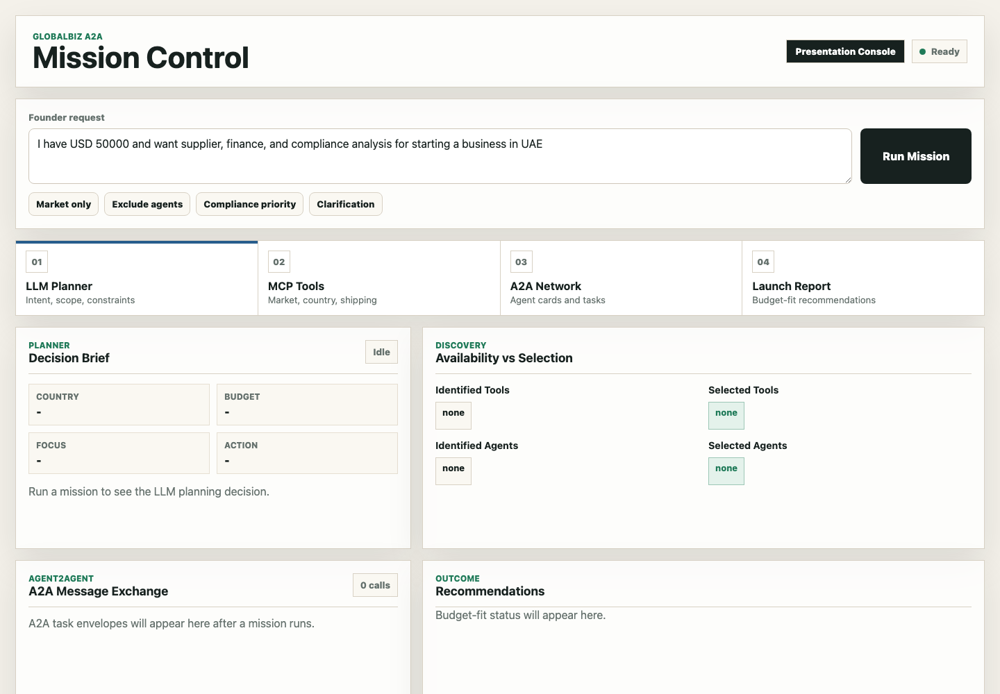

# GlobalBiz A2A Business Advisor

An AI-powered global business launch advisor that demonstrates Agent-to-Agent
(A2A) collaboration at code level.

The user asks a business launch question, the Business Advisor Agent uses an
LLM planner to decide which MCP-style tools and external agent capabilities are
needed, then produces a structured recommendation with a visible execution
trace.

## What This Demo Shows

- LLM-based planning instead of hardcoded routing.
- Agent discovery through a capability registry.
- MCP-style tool calls for market, country, and shipping data.
- External demo agents for supplier, finance, and compliance analysis.
- Clarification questions when required inputs are missing.
- Scope control for unrelated or illegal business requests.
- Budget-aware filtering of business options.
- A visual Mission Control dashboard for presentations.

## Architecture

```text
User
  |
  v
Business Advisor Agent
  |
  +-- LLM Planner
  |     |
  |     +-- Identifies available tools
  |     +-- Identifies available agent capabilities
  |     +-- Selects only what the user query needs
  |
  +-- MCP-Style Tools
  |     |
  |     +-- market_tool
  |     +-- country_tool
  |     +-- shipping_tool
  |
  +-- A2A Capability Registry
        |
        +-- supplier.analysis
        +-- finance.feasibility
        +-- compliance.review
```

## Project Structure

```text
business-advisor/
  app.py                    # CLI demo
  web_app.py                # Mission Control web server
  agents/
    advisor.py              # Main orchestrator
    planner.py              # LLM-only planner
    registry.py             # A2A discovery and task dispatch
    supplier.py             # External supplier agent
    finance.py              # External finance agent
    compliance.py           # External compliance agent
  tools/
    market_tool.py          # Market/product assumptions
    shipping_tool.py        # Import/export and logistics assumptions
    country_tool.py         # Country setup assumptions
  data/
    products.json           # Country-specific business options
    countries.json          # Country setup details
    agent_registry.json     # External agent cards and capabilities
  static/
    index.html              # Mission Control dashboard
    console.html            # Step-by-step presentation console
  requirements.txt
```

## How The Flow Works

1. The user enters a business question.
2. The Advisor sends the query to the LLM planner.
3. The planner returns a strict JSON plan:
   - action
   - country
   - budget
   - identified tools
   - selected tools
   - identified agent capabilities
   - selected agent capabilities
   - reasoning
4. The Advisor validates required dependencies for the selected capabilities.
5. MCP-style tools provide local business data.
6. The Advisor discovers external agents from the registry.
7. Selected external agents receive task envelopes and return analysis.
8. The Advisor merges everything into final recommendations.

## Requirements

- Python 3.10+
- OpenAI API key

Create a local `.env` file:

```text
OPENAI_API_KEY=your_api_key
OPENAI_MODEL=gpt-4.1-mini
```

`.env` is ignored by git. Use `.env.example` as the safe template.

## Run The CLI Demo

```bash
cd business-advisor
python3 app.py
```

The CLI prints the full demo trace:

```text
Step 1: User request and planner decision
Step 2: Discovery surface
Step 3: LLM selection
Step 4: A2A capability registry
Step 5: A2A message exchange
Step 6: MCP tool and advisor trace
Step 7: Final recommendations
Step 8: Recommended next step
```

## Run Mission Control

```bash
cd business-advisor
python3 web_app.py
```

Open:

```text
http://127.0.0.1:8090/
```

If port `8090` is already used, run on another port:

```bash
PORT=8091 python3 web_app.py
```

Then open:

```text
http://127.0.0.1:8091/
```

Presentation console:

```text
http://127.0.0.1:8090/static/console.html
```

If you changed the port, use the same port for the console page. For example:

```text
http://127.0.0.1:8091/static/console.html
```

The Mission Control dashboard is designed for demos. It shows the user request,
LLM plan, available capabilities, selected capabilities, A2A exchange, trace,
budget fit, and final recommendation.

## Screenshots

Mission Control dashboard:



Step-by-step presentation console:


## Demo Prompts

Use these prompts to show different planner decisions:

```text
I want to do a business in USA with a budget of USD 50000.
```

Expected: full strategy using market data and relevant external agents.

```text
I have USD 10000. Check only whether the business ideas are financially feasible in UAE.
```

Expected: finance-focused path with budget filtering.

```text
I want to do a business in UK, budget 10000, compliance to be the top priority.
```

Expected: compliance-focused path with country setup and compliance review.

```text
I want market research only for Singapore with USD 25000.
```

Expected: market-focused path without unnecessary finance, supplier, or
compliance agents.

```text
I want to start a business.
```

Expected: Advisor asks a clarification question before calling tools or agents.

```text
What is the capital of France?
```

Expected: out-of-scope response.

```text
I want to start a money laundering business.
```

Expected: refusal because the request is illegal.

## Supported Demo Countries

```text
USA, UAE, UK, Canada, Australia, Singapore, India
```

If a country is outside the demo dataset, the Advisor returns a friendly
country-specific knowledge message and does not run the business analysis.

## Planner Behavior

The planner is intentionally LLM-only. If the OpenAI API key is missing, invalid,
or unreachable, the app returns a planner error instead of using hardcoded
fallback routing.

The code still performs safety checks around the LLM output:

- Invalid tool names are ignored.
- Invalid capability names are ignored.
- Missing country or budget becomes a clarification request.
- Required dependencies are added for selected capabilities.
- Out-of-scope and illegal requests do not call tools or agents.

This keeps the demo intelligent while still preventing broken execution paths.

## A2A Demo Details

External agents are represented by agent cards in `data/agent_registry.json`.
Each card exposes a capability, endpoint, version, and description.

During execution, the Advisor:

1. Discovers available capabilities from the registry.
2. Selects only the capabilities chosen by the LLM planner.
3. Builds a task envelope for each selected capability.
4. Sends the task through the local A2A client.
5. Records the request and response in the visible A2A event trace.

This is a local demo implementation, but the shape mirrors a real A2A system:
discovery, capability selection, task dispatch, and response aggregation.

## Deployment

The repository includes Render deployment files:

- `render.yaml`
- `Procfile`

Recommended Render settings:

```text
Build Command: cd business-advisor && pip install -r requirements.txt
Start Command: cd business-advisor && python web_app.py
Environment:
  OPENAI_API_KEY = your key
  OPENAI_MODEL = gpt-4.1-mini
```

Do not commit `.env`. Add the API key only in the hosting provider's environment
variable settings.

## Tests

Run the lightweight local test suite:

```bash
cd business-advisor
python3 -m unittest discover -s tests -v
```

These tests do not call OpenAI. They use fake planner output to verify planner
normalization, missing country or budget handling, unsupported countries, A2A
trace generation, and budget filtering.

## Optional LLM Smoke Test

This smoke test uses a small number of OpenAI API calls:

```bash
cd business-advisor
python3 test_scenarios.py
```

Use it before a demo to confirm the planner is returning valid plans for common
scenarios.
